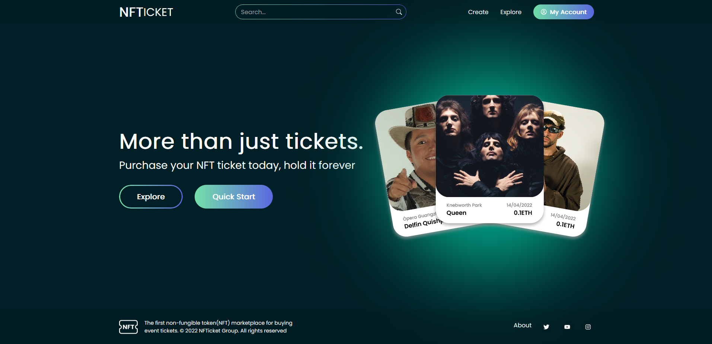
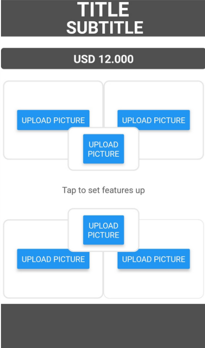

# Hi 👋, I am Fede (Fred) Prat! 

## 🚀 About Me
I'm a full stack developer looking for my first fulltime job

I love react and writing TypeScript 

📫 If you have any questions you can reach me by my 
[LinkedIn](https://www.linkedin.com/in/fred-prat/) or you can send me a message through my
web [here](https://portfoliowebfred.vercel.app/contact)

## 🛠 Skills
My strong areas are Javascript, TypeScript, ReactJS, React Native, NextJS, NodeJS, ExpressJS, Sequelize, PostgreSQL, Prisma, Redux, Jest, React-testing library, SuperTest    

## 🔗 Links

## ⚡️ My most important projects 

### 📜 [NFTickets](https://github.com/fedeprat/NFTickets) 
  

This app is a 100% real NFT tickets store that lets you buy NFT tickets to attend an event that are also NFTs that you will hold forever in your metamask extension.

You can also create your own event with a previously chosen amount of tickets for sale, and people will buy it to go to your event.

All this operations are 100% real blockchain validated operations. We work with Ropsten's test network using rETH's as cryptocurrency

If you head over to quick start section you will find some videos and explanations about how to use our NFT tickets app.

🔗 *More information on the github repo (it is open source)* [here](https://github.com/fedeprat/NFTickets)

🔗 *Deployed App:* [NFTickets](https://nftickets.netlify.app/)

I've made this app along with

Alejo
 
 
Diego 

 
Martin

 
Alfredo

 
Luciano

 
Franco

 
Andres

 

### 📜 [Realtor Assistant](https://github.com/fedeprat/RealtorAssistant)

 
 
RealtorAssistant is a mobile app I made for my brother who is a real estate agent. He told me he was losing a lot of time making his WhatsApp status / instagram stories pictures of the houses he has for sale or rent. So I thought I could make an app that lets you make a 1080x1920 image containing the best pics of the house as well as some key info about it.
 
 
I made this app using Expo, TypeScript, React Native, Redux, ImagePicker to administrate permissions and image upload, Keyword aware scrollView to manage keyboard behavior and React Native Navigate to go from one screen to another.
 
 
🔗 [Link to Repo](https://github.com/fedeprat/RealtorAssistant) | There you will find a QR code to run the app yourself on your device

